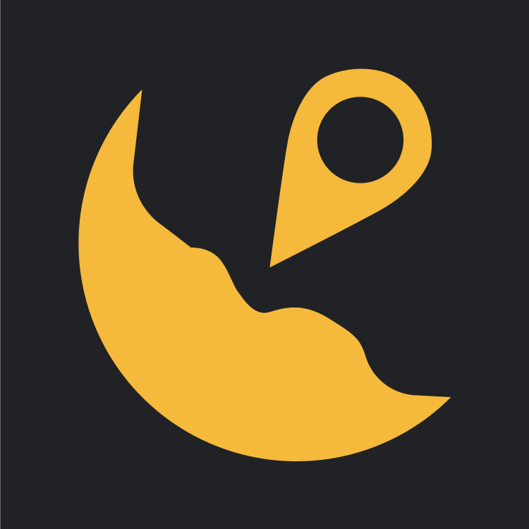
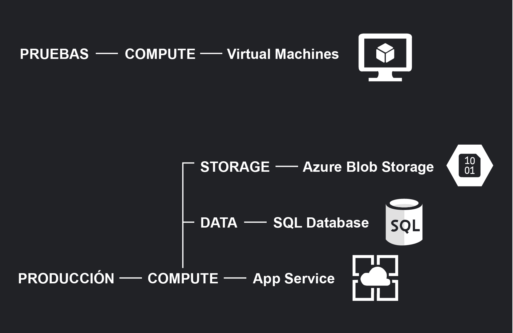
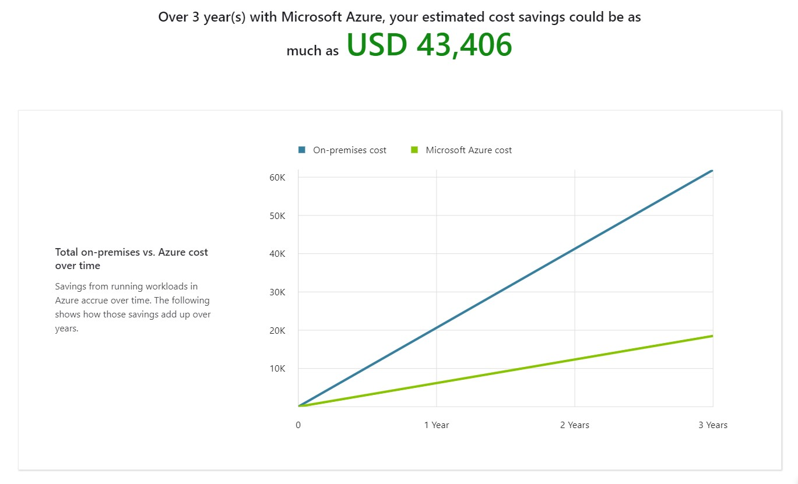
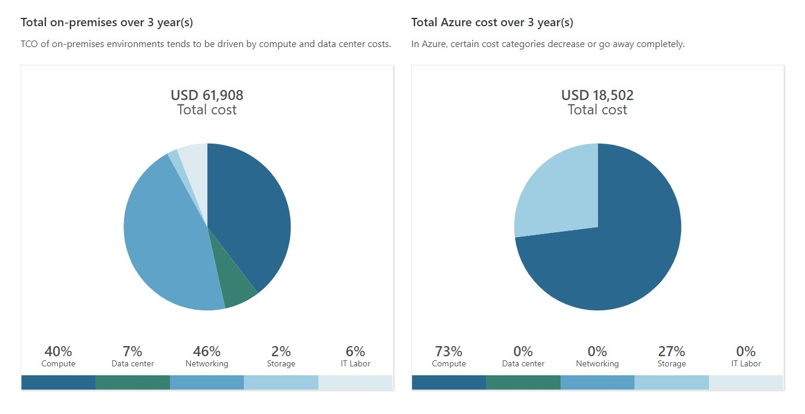
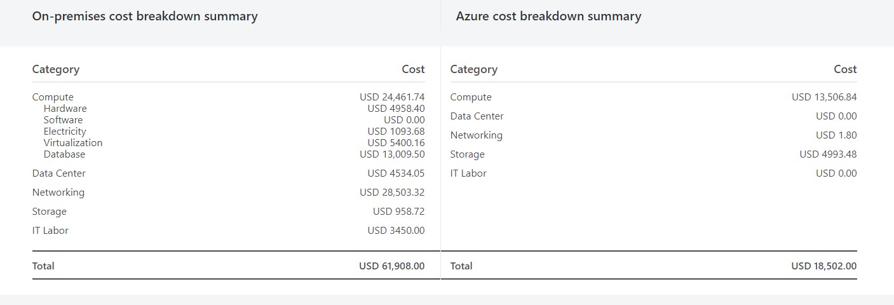

# BachApp

## Introducción

##### Aplicacion Web para reportar baches en la ciudad, mientras que los encargados de mantenimiento de calles pueden encontrar los lugares exactos y tener una mejor idea de la gravedad y el material necesario para repararlos gracias a las fotografias.

### Link al Tiktok
[Yo soy el link](https://vm.tiktok.com/ZMd3J9hb2/)

### Diagrama de Azure

### Precio Total por mes
##### Pruebas
| Servicio | Descripcion | Precio Estimado Mensual |
| ------ | ------ | ------ |
| Virtual Machine | 1 F2 (2 vCPUs, 4 GB RAM) x 730 Hours (Pay as you go), Linux,  (Pay as you go); 1 managed disk – E4, 100 transaction units; Inter Region transfer type, 5 GB outbound data transfer from East US to Central US | $74.87 |
|  | Total | $74.87|
##### Producción

| Servicio | Descripcion | Precio Estimado Mensual |
| ------ | ------ | ------ |
| App Service | Basic Tier; 1 B1 (1 Core(s), 1.75 GB RAM, 10 GB Storage) x 730 Hours; Linux OS | $12.41 |
| Azure SQL Database | Single Database, vCore, {1}, General Purpose, Provisioned, Gen 5, Local Redundancy, 1 - 4 vCore instance(s), 1 year reserved, 10 GB Storage, 1 GB Backup Storage | $582.23 |
| Storage Accounts | Block Blob Storage, Blob Storage, LRS Redundancy, Hot Access Tier, 1000 GB Capacity - Pay as you go, 100,000 Write operations, 100,000 List and Create Container Operations, 100,000 Read operations, 100,000 Archive High Priority Read, 1 Other operations. 1000 GB Data Retrieval, 1000 GB Archive High Priority Retrieval, 1000 GB Data Write | $21.84 |
|  | Total | $616.48 |

### TCO 3 años

### SLA Compuesto
| Elemento | SLA |
| ------ | ------ |
| App Service | 99.95% |
| Blob Storage (LRS) | 99.9% |
| Azure SQL Database | 99.99% |
| TOTAL | 99.84% |

### Tiempo sin disponibilidad a un año
##### 5.25 horas

### Qué te pareció el evento
En tan solo 40 horas cada uno de nosotros vivimos una experiencia retadora, la cual puso a prueba nuestras habilidades obtenidas a lo largo de Innovacción y también nuestra capacidad de trabajar en equipo al estar a distancia y de manera virtual.

Las diversas actividades impartidas por los Sherpas junto con los Student Ambassadors fueron un punto clave para mantener el ambiente entusiasmado y ayudo a acercarnos más a nuestros compañeros. Nos permitió ir un poco más allá de lo que solemos hacer y crecer como personas.

Fue gratificante ver como a pesar de ser de distintas carreras, o incluso similares, nuestros conocimientos se pudieron complementar con el fin de llegar al mejor resultado para solucionar la problemática encontrada.

Nuestro equipo se compuso de personas de distintos estados de la Republica Mexicana lo cual ayudo a enriquecer nuestra experiencia en este Summer Hack, ya que gracias a esto hemos obtenido nuevos contactos y amigos para poder colaborar en un futuro, también aprendimos de las habilidades y conocimientos del otro.

Sin duda el participar en esta propuesta fue un desafío que nos dejó un acercamiento a lo que será el campo laboral y sin duda nos seguiremos preparando al contar con nuevas herramientas para contribuir a un mundo mejor.